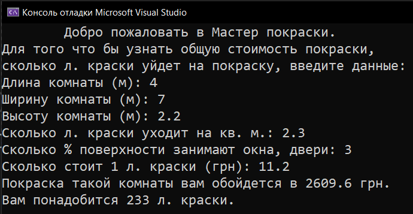
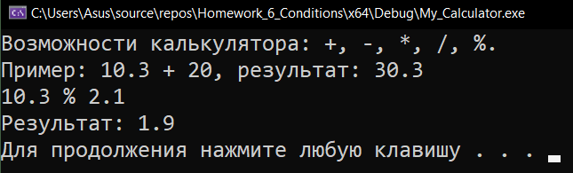
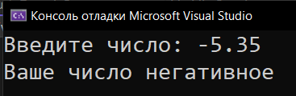

# Homework_6_Conditions
Д/з: Conditions

<a href="https://gist.github.com/SlavikArt/492e4c8dc242e9e5bc9e136d1ebe22c9">Gist - страница со всеми кодами проектов</a>

* [How_Much_To_Paint_A_Room](How_Much_To_Paint_A_Room)
* [My_Calculator](My_Calculator)
* [My_Min_Function](My_Min_Function)
* [Positive_Or_Negative](Positive_Or_Negative)

    <h2>How much to paint a room</h2>
    
Сколько нужно денег и краски на покраску комнаты.

    
    <h2>My calculator</h2>
    
Мой калькулятор.

    
    <h2>My min function</h2>
    
Найти наименьшее число.

    
    <h2>Positive or negative</h2>
    
Позитив, негатив или 0, какой ты сегодня?)

    

